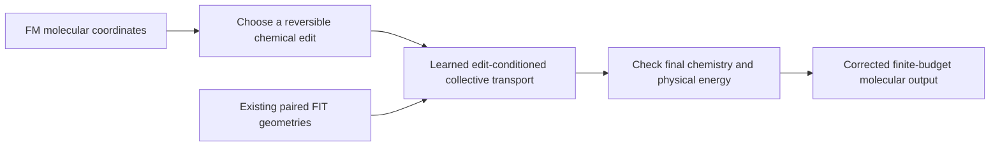

# Candidate AI framework: edit-conditioned reversible molecular transport

The user explicitly corrected the priority: establish a useful, differentiated
AI framework and test it quickly; do not require perfect physical optimization
on every case first. The planned19-arm optimizer recovery is paused before
submission. Existing diagnostics are retained as data and limitations.

## Central hypothesis

A chemical edit changes the preferred geometry of the whole molecule. Learning
the resulting collective deformation as part of the proposal can be more useful
than learning a local two-root geometry or filtering an already constructed
candidate. The neural network should see the proposed edit and move all atoms
coherently, while the proposal's reversal is built into its architecture.

The current prototype implements that hypothesis in
`cfm_mol/edit_conditioned_bridge.py`. Flow matching remains the initializer.
The new correction is a discrete reversible neural transport, not a claim to
have invented flow matching or the three original BGFM loss identities.

## What changes in the model

The equivariant message-passing field receives current coordinates, atomic
descriptors, electronic state, both the original and proposed bond graphs, and
bridge time. It predicts collective coordinate-control forces. Graph features
are `(1-t)G+tG'`, `|G'-G|` and `(2t-1)(G'-G)`, together with symmetric time and
edit-role features. Thus the same field is used under
`(G,G',t) -> (G',G,1-t)`. The network is not conditioned on an unrecorded initial
geometry that would differ in the reverse proposal.

The model uses paired momentum kicks and coordinate drifts, with the existing
invertible chemical exchange at the middle. All neural intermediate steps are
free of physical-oracle queries. Final chemistry must match the expected edited
graph and admit the inverse action. Endpoint validity and actual energy checks
remain part of the future sampling caller; the primitive is not a released sampler.

For a centered Gaussian auxiliary momentum, each kick/drift is a triangular
unit-volume map on the COM subspace. The chemical coordinate map contributes its
known intrinsic Jacobian. Mirrored graph/time conditioning and final momentum
reversal give the paired inverse. The augmented log acceptance ratio is

    -(U(y)-U(x))/kT + (||p||^2-||p'||^2)/2
    + log|J_edit| + log p(reverse_edit|y) - log p(edit|x).

This uses no FM-source likelihood, no determinant product for overlapping
coordinate blocks and no unaccounted relaxation. It is ordinary augmented MH
with a proposed neural architecture. It does not supply exact finite-time
Boltzmann samples or a Jarzynski normalizer for the unknown initial distribution.

## Closest work and novelty boundary

The targeted review is not a novelty certificate. Primary sources checked:

| Work | What is already established | Candidate distinction to test here |
| --- | --- | --- |
| [L2HMC, ICLR2018](https://research.google/pubs/generalizing-hamiltonian-monte-carlo-with-neural-networks/) | Neural MCMC updates and learning accepted movement | Explicit molecular-edit conditioning and paired whole-molecule deformation, not learned HMC itself |
| [Timewarp](https://arxiv.org/abs/2302.01170) | Transferable learned molecular transition proposals | Correction across declared connectivity edits, rather than claiming general learned dynamics |
| [Learning Escorted Protocols, ICLR2026](https://proceedings.iclr.cc/paper_files/paper/2026/hash/09bddc7169034c8f3e2fd1946cc3d2e4-Abstract-Conference.html) | Conditional flow/density matching for escorted free-energy protocols and flow graphs | A shared edit-conditioned molecular proposal and its measured generation/sampling value; no new general work identity |
| [NHMC, August2026 revision](https://arxiv.org/abs/2607.15682) | Neural nonequilibrium Hamiltonian paths, work correction and a round-trip invariant kernel | The specific chemical-edit representation and collective transport mechanism need evidence; generic neural work correction is already covered |

The proposed contribution is conditional chemical-edit transport that is useful
across molecular contexts. Symmetry, shears, MH, work and neural-force fitting
alone are not new. This is a concrete architectural hypothesis, not an established
ICLR-level novelty claim. Positive results must isolate what the edit-conditioned
collective representation adds beyond simpler learned and physical alternatives.

## Fast decisive experiment

First train three equal-size variants with two seeds: edit-conditioned collective,
geometry-only collective with the edit features removed, and edit-conditioned
root-only transport. The root-only ablation preserves passive relative coordinates
through both kicks and drifts. Core tests cover graph/time reversal, O(3)/atom
permutations, full augmented inverse/Jacobian, MH-ratio reversal and gradients.
These essential checks replace an open-ended optimization audit as the entry gate.

The192 paired examples use all32 existing FIT parents and six bounded readouts
from the already completed mobility traces. Both directions are trained. They
are valid observed coordinates, not necessarily minima or equilibrium samples.
No new physical labels are requested. Historical source/proposal and9,332 mobility
queries are still training costs, not free data. Both failed and successful
parents remain. Pretraining minimizes paired geometry error with a momentum
regularizer; this loss is not presented as a new physics theorem or Boltzmann fit.

`research/evidence/edit_bridge_training_protocol_v1.json` freezes300 steps,
batch2, matched sampled indices/noises and initialization seeds, and all three
variants. Its results are fitting evidence only. Freeze final weights and next
evaluate actual corrected proposals on the existing12 internal evaluation parents,
which do not enter fitting. Count all unsupported proposals and electronic states,
true endpoint queries and runtime. Include the physical site/arc baseline and an
analytic or zero-field bridge in the full comparison. Useful accepted structural
movement and energy-aware output per budget matter; raw acceptance alone can
reward negligible moves.

If a clear signal appears, run short matched-budget molecular chains and a fresh
small composition check before broadening. Do not wait for perfect convergence,
all elements or every old failure. If the edit/full-coordinate ablations do not
support the mechanism, revise the framework; do not disguise a fitting improvement
as molecular effectiveness. The722 reserved outcomes remain untouched.
